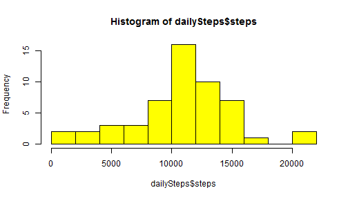
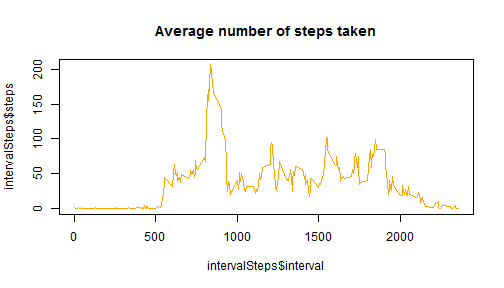

Reporducible Data - Assignment #1
========================================================

## Project setup

### Load data
Set your working directory

```r
setwd('C:/www/r/RepData_PeerAssessment1')
```


Load the "quantified self" activity data 

```r
data <- read.table( "activity.csv"
                    , sep = ","
                    , header = TRUE
                   )
```

Make sure you got the data:


```r
head(data)
```

```
##   steps       date interval
## 1    NA 2012-10-01        0
## 2    NA 2012-10-01        5
## 3    NA 2012-10-01       10
## 4    NA 2012-10-01       15
## 5    NA 2012-10-01       20
## 6    NA 2012-10-01       25
```

### Load dependant libraries
Libraries include
* xtable


```r
library(xtable)
library(lubridate)
```


## Globally Preprocess Data
Add weekday to data

```r
data$dayofweek = wday(data$date)
```

Make sure you got the day of week was added to the sata:


```r
head(data)
```

```
##   steps       date interval dayofweek
## 1    NA 2012-10-01        0         2
## 2    NA 2012-10-01        5         2
## 3    NA 2012-10-01       10         2
## 4    NA 2012-10-01       15         2
## 5    NA 2012-10-01       20         2
## 6    NA 2012-10-01       25         2
```


## Questions and Answers

### Q1. What is mean total number of steps taken per day?
**Process the data**
Aggregate the of steps per day

```r
dailySteps <- aggregate(steps ~ date, data, FUN=sum)
```

**Explore the data**

```r
head(dailySteps)
```

```
##         date steps
## 1 2012-10-02   126
## 2 2012-10-03 11352
## 3 2012-10-04 12116
## 4 2012-10-05 13294
## 5 2012-10-06 15420
## 6 2012-10-07 11015
```

```r
hist( dailySteps$steps, breaks = 10, col="yellow" )
```

 

***Answer* - Mean steps taken per day:**

```r
mean(dailySteps$steps, na.rm=T)
```

```
## [1] 10766
```

***Answer* - Median steps taken per day:**

```r
median(dailySteps$steps, na.rm=T)
```

```
## [1] 10765
```


### Q2. What is the average daily activity pattern?
**Process the data**
Aggregate the of steps per interval

```r
intervalSteps <- aggregate(steps ~ interval, data, FUN=mean)
```

**Explore the data**

```r
head(intervalSteps)
```

```
##   interval   steps
## 1        0 1.71698
## 2        5 0.33962
## 3       10 0.13208
## 4       15 0.15094
## 5       20 0.07547
## 6       25 2.09434
```
**Q2aMake a time series plot of the 5-minute interval and the average number of steps taken, averaged across all days**


```r
plot(intervalSteps$interval, intervalSteps$steps, type="l", col="orange")
```

 

**Q2b) Which 5-minute interval, on average across all the days in the dataset, contains the maximum number of steps?**
The Interval with the highest Value

```r
intervalSteps[ intervalSteps$steps == max(intervalSteps$steps), ]
```

```
##     interval steps
## 104      835 206.2
```


### Q3) What is the impact of imputing missing data on the estimates of the total daily number of steps?


**Add missing data**  
Create a function to get the average steps per interval

```r
getIntervalAverageSteps <- function(interval) {

        avgSteps = intervalSteps$steps[ intervalSteps$interval == interval]
        avgSteps

}
```


**Input missing data**  
Create a new dataset that is equal to the original dataset but with the missing data filled in.

```r
dataFilled <- data
dataFilled$steps[ is.na(dataFilled$steps) ] <- getIntervalAverageSteps( dataFilled$interval )
```

```
## Warning: number of items to replace is not a multiple of replacement
## length
```

**Determine "Filled" total number of steps taken each day**

```r
dailyStepsFilled <- aggregate(steps ~ date, dataFilled, FUN=sum)
```


**Make a histogram of the total number of steps taken each day**

```r
hist( dailySteps$steps, breaks = 10, col="red" )
```

 

***Answer* - Mean steps taken per day:**

```r
meanFilled <- mean(dailyStepsFilled$steps, na.rm=T)
```


```
## [1] 10766
```

***Answer* - Median steps taken per day:**

```r
median(dailyStepsFilled$steps, na.rm=T)
```

```
## [1] 10766
```

**Food for tought:**  
Why does the *summary* function come out with differnet number

```r
summary(dailyStepsFilled$steps, na.rm=T)
```

```
##    Min. 1st Qu.  Median    Mean 3rd Qu.    Max. 
##      41    8860   10800   10800   13200   21200
```

```r
summary(dailyStepsFilled$steps, na.rm=F)
```

```
##    Min. 1st Qu.  Median    Mean 3rd Qu.    Max. 
##      41    8860   10800   10800   13200   21200
```

***Answer* - What is the impact of imputing missing data on the estimates of the total daily number of steps?**  
There was not a significant impact to adding the data.  The unfilled mean was 1.0766 &times; 10<sup>4</sup> the filled mean was 1.0766 &times; 10<sup>4</sup>.  The unfilled median was 1.0766 &times; 10<sup>4</sup> and the filled median was 1.0766 &times; 10<sup>4</sup>.


### Q4) Are there differences in activity patterns between weekdays and weekends?
**Create a new factor variable in the dataset with two levels -- "weekday" and "weekend"**  

Create a weekend dataset

```r
dataWeekend <- subset( dataFilled, dataFilled$dayofweek == 1 | dataFilled$dayofweek == 7 )
```
checkout our weekend data

```r
head(dataWeekend)
```

```
##      steps       date interval dayofweek
## 1441     0 2012-10-06        0         7
## 1442     0 2012-10-06        5         7
## 1443     0 2012-10-06       10         7
## 1444     0 2012-10-06       15         7
## 1445     0 2012-10-06       20         7
## 1446     0 2012-10-06       25         7
```

```r
head( unique( wday(dataWeekend$dayofweek, label = T) ) )
```

```
## [1] Sat Sun
## Levels: Sun < Mon < Tues < Wed < Thurs < Fri < Sat
```

Find the weekend average

```r
weekendIntervalSteps <- aggregate(steps ~ interval, dataWeekend, FUN=mean)
```

Create a weekday dataset

```r
dataWeekday <- subset( dataFilled, dataFilled$dayofweek != 1 & dataFilled$dayofweek != 7 )
```

checkout our weekday data

```r
head(dataWeekday)
```

```
##     steps       date interval dayofweek
## 1 1.71698 2012-10-01        0         2
## 2 0.33962 2012-10-01        5         2
## 3 0.13208 2012-10-01       10         2
## 4 0.15094 2012-10-01       15         2
## 5 0.07547 2012-10-01       20         2
## 6 2.09434 2012-10-01       25         2
```

```r
head( unique( wday(dataWeekday$dayofweek, label = T) ) )
```

```
## [1] Mon   Tues  Wed   Thurs Fri  
## Levels: Sun < Mon < Tues < Wed < Thurs < Fri < Sat
```

Find the weekday average

```r
weekdayIntervalSteps <- aggregate(steps ~ interval, dataWeekday, FUN=mean)
```


```r
par(mfrow = c(2, 1))
plot(weekendIntervalSteps$interval, 
     weekendIntervalSteps$steps, 
     type="l", 
     col="green",
     main="Weekend Steps")
plot(weekdayIntervalSteps$interval, 
     weekdayIntervalSteps$steps, 
     type="l", 
     col="blue",
     main="Weekeday Steps")
```

 
